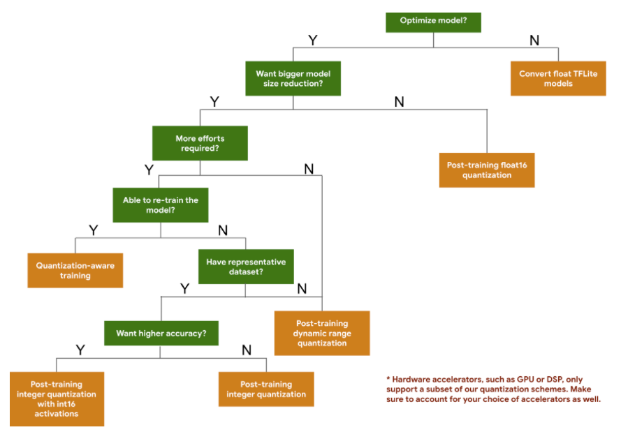

# Deployment

部署深度学习应用

## 模型部署

### 模型优化

模型的优化包括模型的量化和剪枝。模型的量化与剪枝都是通过tensorflow简单的API进行操作。

#### 模型量化

量化的工作原理是降低用于表示模型参数表示的数字的精度，如将`float32`转换成`float16`。通过这样可获得较小的模型大小和较快的计算速度。

在Tensorflow Lite中提供以下量化类型：

|        技术        |      数据要求      | 大小缩减 |      准确率      |     支持的硬件     |
| :----------------: | :----------------: | :------: | :--------------: | :----------------: |
| 训练后Float16量化  |       无数据       | 高达50%  | 轻微的准确率损失 |      CPU、GPU      |
| 训练后动态范围量化 |       无数据       | 高达75%  | 极小的准确率损失 |      CPU、GPU      |
|     训练后量化     | 无标签的代表性样本 | 高达75%  | 极小的准确率损失 | CPU、GPU、Edge TPU |
|    量化感知训练    |  带标签的训练数据  | 高达75%  | 极小的准确率损失 | CPU、GPU、Edge TPU |



模型的量化主要分为两个方面，一个是训练后量化，另一个是训练时量化。


#### 模型压缩


## CMakeList

CmakeList的Demo，包括生成执行文件以及生成DLL的Demo。在此讲一下DLL，后续会将算法模型编译成dll供程序调用。

DLL可以将程序模块化为单独的组件，可参考微软官方文档：[dynamic link library](https://docs.microsoft.com/zh-cn/troubleshoot/windows-client/deployment/dynamic-link-library)，DLL具有如下优势：

- 使用更少资源。当多个程序使用的函数库时，DLL可以减少在磁盘和物理内存中加载的代码重复。它不仅会太大影响前台运行的程序性能，还会影响在Windows操作系统上运行的其他程序的性能。
- 提升模块化体系结构。DLL有助于推动开发模块化程序。
- 简化部署和安装。

DLL编译过程：注意根目录指的是`CMakeListDemo\dllDemo\`
1. 在根目录运行`cmake`命令，在根目录和lib目录下编译出`Makefile`文件
2. 在根目录或者lib目录下使用`make install`即可编译出`DLL`库
3. 在根目录的`lib_out`下生成了DLL，名称为`testdll.dll`


## ONNX转换

ONNX的转换主要是Pytorch转换、Tensorflow转换、keras转换。

- Pytorch

Pytorch的转换主要以YOLOV4为例子，YOLOV4权重下载地址：[百度网盘](https://pan.baidu.com/s/1RbVt1Y1eCxNZJjq5-wHUBg)，提取码：03cc。转换脚本请见ONNXDemo下的Pytorch文件夹。pytorch模型成功转换成ONNX后，可以通过ONNXDemo下的inference文件进行测试。Pytorch的转换应用了torch自带的`torch.onnx.export`API。

- Keras

Keras主要使用Unet作为样例。关于转换样例，可以参考我的仓库：[unet-tensorflow](https://github.com/RyanCCC/unet-tensorflow)，喜欢的可以给个star。在这里可能有个疑惑，tensorflow2.\*已经把keras给吃掉了，在这里为什么还要分开keras和tensorflow呢？Keras的话主要对`h5`文件进行转换。而Tensorflow主要对`pb`文件进行转换。在TensorFlow2的环境下会出现以下错误，解决方案也提示很清楚了。

```
This is a tensorflow keras model, but keras standalone converter is used. Please set environment variable TF_KERAS = 1 before importing keras2onnx.
```
- Tensorflow

主要使用`tf2onnx`模块。这里贴一个`tensorflow`权重抓换成`pb`模型的例子：

```python
import os
import shutil
import tensorflow as tf
from assets.tensorflow_to_onnx_example import create_and_train_mnist
def save_model_to_saved_model(sess, input_tensor, output_tensor):
    from tensorflow.saved_model import simple_save
    save_path = r"./output/saved_model"
    if os.path.exists(save_path):
        shutil.rmtree(save_path)
    simple_save(sess, save_path, {input_tensor.name: input_tensor}, {output_tensor.name: output_tensor})

print("please wait for a while, because the script will train MNIST from scratch")
tf.reset_default_graph()
sess_tf, saver, input_tensor, output_tensor = create_and_train_mnist()
print("save tensorflow in format \"saved_model\"")
save_model_to_saved_model(sess_tf, input_tensor, output_tensor)
```

转换成pb格式后使用tf2onnx即可转换成onnx

### 遇到问题

1. numpy() is only available when eager execution is enabled


之前也遇到过这个问题，大概意思是在tensorflow计算图下只能使用tensorflow框架下的运算算子，而不能使用tensorflow外的算子。

解决方案：


## TensorRT部署

TensorRT部署经常会遇到版本问题。在Windows+Python+Tensorrt8.4.15环境搭建起来比较麻烦，建议在Linux+CPP+TensorRT这样搭配会好一点。这一块主要以YOLOX为例子完成Linux平台下C++的Tensorrt部署。

## OpenVino部署

OpenVino环境要求“很高”，如下所示，把我给劝退了。后续还是专心于TensorRT，有时间再玩一下OpenVino。具体操作代码在[YOLOV5 CPP](https://github.com/RyanCCC/Deployment/tree/main/YOLOV5/yolov5_cpp)。OpenVINO的对象主要使用的是YOLOV5。


## Tensorflow Serving部署

可参考我的博客：[模型部署 利用Tensorflow Serving部署模型](https://blog.csdn.net/u012655441/article/details/125332182)
